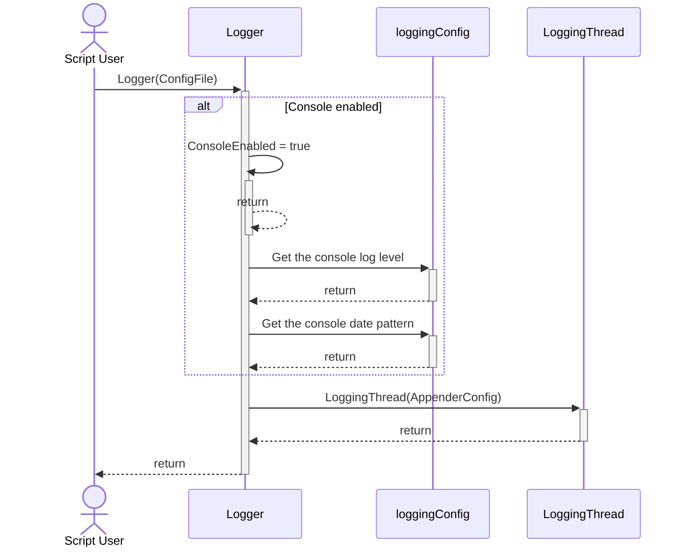

# Overview
The Log4PowerShell logging framework provides a logging framework that can be used within scripts, modules, and classes.  It is an object-oriented implementation, and is configured at runtime via a JSON configuration file.  The JSON configuration file allows a user to specify multiple destinations for each logging statement generated through the framework.  Destinations for logging statements are referred to as **appenders**, and there are multiple types of appenders that can be specified within the configuration file.  These include:

* A file appender that sends each log message to a specific text file.
* A CSV appender that sends each log message to a specific CSV file.
* A Google Chat appender that sends each log message to a specified Google Chat Channel.

Each appender type is described in detail below.  

## The Configuration JSON File
By default, the logging framework looks for the JSON configuration file under the project **config** directory.  To be more specific, the logging framework looks for a file called logging.json by default.

## Starting the Logging System
To start the logging system, simply execute the **Start-Logging.ps1** script located in the root directory of this project.  This script simply creates an instance of the **Logger** class, and places it into the global scope of the current PowerShell session.

## Coding Standards
The following coding standards are adhered to for this implementation.

### Classes
Each class implemented for this framework is definied within its own module file under the **classes** directory of this project.  

#### Naming Conventions
Class names, property names, and method names follow PascalCase (e.g., MyClass, MyProperty, MyMethod).

## Sequence Diagrams

### Creating the Logger

    participant TIMS as Test_Invoke_Migrate_Site.ps1
    participant IMS as Invoke-MigrateSite
    participant SV as Source vCenter
    participant MM as VMware.Lifecycle.MigrateVCSA.psm1
    participant TV as Target vCenter

    SU->>+TIMS: Execute script
        TIMS->>+IMS: Execute script
            IMS->>+SV: Connect-VIServer
            SV-->>-IMS: return

            IMS->>+MM: Get-SiteFilter
                MM->>+SV: Retrieve Site Inventory Item List
                SV-->>-MM: return
            MM-->>-IMS: return

            IMS->>+MM: Get-Site
                MM->>+SV: Retrieve Site Inventory Item Configuration
                SV-->>-MM: return
            MM-->>-IMS: return

            IMS->>+SV: Disconnect-VIServer
            SV-->>-IMS: return
    
            IMS->>+TV: Connect-VIServer
            TV-->>-IMS: return

            IMS->>+MM: Set-Site
                MM->>+TV: Create the Site Inventory
                TV-->>-MM: return
            MM-->>-IMS: return

            IMS->>+TV: Disconnect-VIServer
            TV-->>-IMS: return

        IMS-->>-TIMS: return
    TIMS-->>-SU: return
