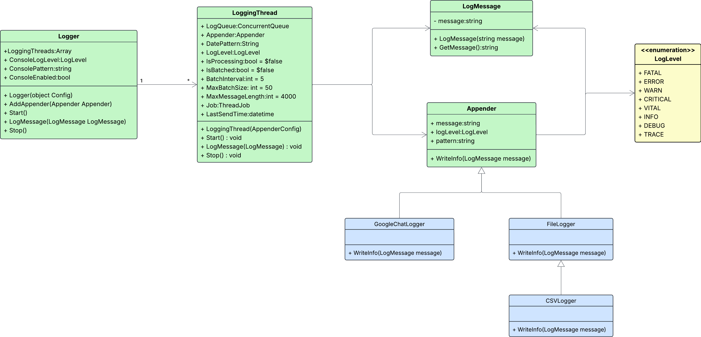
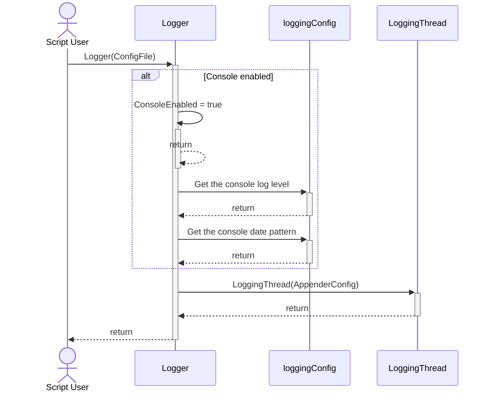

# Getting Started
The Log4PowerShell logging application provides a framework for creating log statements within PowerShell scripts, modules, and classes.  The implementation for this module is object-oriented, and is configured at runtime via a JSON configuration file.  The JSON configuration file allows a user to tailor the logging system to send log messages to a number of different types of supported endpoints.  Currently, the following types of endpoints are supported:

* Text files.
* CSV files.
* Google Chat channels.

The configuration supports the creation and use of more than one of each type of endpoint, as well as customizing the log message output and format to each endpoint.

The Log4PowerShell logging framework places each endpoint processing object into its own PowerShell JobThread object, and uses a ConcurrentQueue within each thread object send log messages to the endpoint processing object, which is called an Appender.  The following class diagram outlines the objects used within the framework



In order to use the logging framework after the configuration has been determined and entered into the JSON file, simply run the **Start-Logging.ps1** script in the root directory of the module in order to create the main logger object from the JSON file, and load it into the global scope for the current PowerShell session.  The logger object can then be used directly from the global scope to send log messages, but it is recommended to use the utility functions in the public directory to perform logging tasks as they simplify use greatly.

## JSON Configuration File
As already mentioned, the Log4PowerShell logging framework is configured by a JSON file passed into the **Start-Logging.ps1** script when the framework is started.  The configuration file has two main sections: one for console output, and the other for the definition of all the appenders that will be used when the framework is started.  The following is an example of a valid configuration JSON file:

```json
{
	"console" : {
		"enabled"     : true,
		"datePattern" : "yyyy-MM-dd HH:mm:ss.fff",
		"logLevel"       : "DEBUG"
	},
	"appenders" : [ {
			"type"              : "CSV",
			"name"              : "csv1",
			"datePattern"       : "yyyy-MM-dd HH:mm:ss.fff",
			"headers"	        : "vCenter,Datacenter,Cluster,ResourcePool",
			"valuesMandatory"   : false,
			"path"              : "C:/logs",
			"fileName"          : "csv-log.csv",
			"append"            : true,
			"rollingPolicy"     : "none",
			"logLevel"          : "DEBUG"
		}, {
			"type"              : "File",
			"name"              : "fileLogger1",
			"path"              : "C:/Users/EdwardBlackwell/Documents/logs",
			"fileName"          : "file-%d{MM-dd-yyyy-HH-mm-ss}-log.log",
			"append"            : true,
			"rollingPolicy"     : "size",
			"rollingFileSize"   : "10Mb",
			"rollingFileNumber" : 5,
			"datePattern"       : "yyyy-MM-dd HH:mm:ss.fff",
			"logLevel"          : "DEBUG"
		}, {
			"type"              : "GoogleChat",
			"name"              : "googleChat1",
			"webhookUrl"        : "https://chat.googleapis.com/v1/spaces/AAQA_2ChzVa/messages?key=AIzaSyDdI0E9vHpvySjMm-WEfRq3CPzqKqqsHI&token=B4hawzNnqxiS_E5vpvFgU3cdMXFND6KGvTv5BEV2PQ",
			"datePattern"       : "yyyy-MM-dd HH:mm:ss.fff",
			"logLevel"          : "DEBUG",
			"maxRetryAttempts"  : 10,
			"retryInterval"     : 10,
			"batchConfig"       : {
				"batchInterval"    : 5,
				"maxBatchSize"     : 50,
				"maxMessageLength" : 500
			}
		}
	]
}
```
## Start-Logging.ps1
The Start-Logging.ps1 script is the script used to start the logging system.  It creates an instance of the **Logger** class, and stores it into the global scope.  The following sequence digram outlines the actual steps involved when the script is executed.



## Appenders
Appenders are the class objects that are dedicated to sending log messages to a specific type of endpoint, such as a text file.  The current Appenders implemented for the logging framework are:

* CSVAppender
* FileAppender
* GoogleChatAppender

Each appender has its own specific configuration parameters defined within the JSON configuration file, and can log single log messages, or a list of log messages, which can occur when batching is configured for the Appender.

## The Configuration JSON File
By default, the logging framework looks for the JSON configuration file under the project **config** directory.  To be more specific, the logging framework looks for a file called logging.json by default.

## Starting the Logging System
To start the logging system, simply execute the **Start-Logging.ps1** script located in the root directory of this project.  This script simply creates an instance of the **Logger** class, and places it into the global scope of the current PowerShell session.

## Coding Standards
The following coding standards are adhered to for this implementation.

### Classes
Each class implemented for this framework is definied within its own module file under the **classes** directory of this project.  

#### Naming Conventions
Class names, property names, and method names follow PascalCase (e.g., MyClass, MyProperty, MyMethod).

